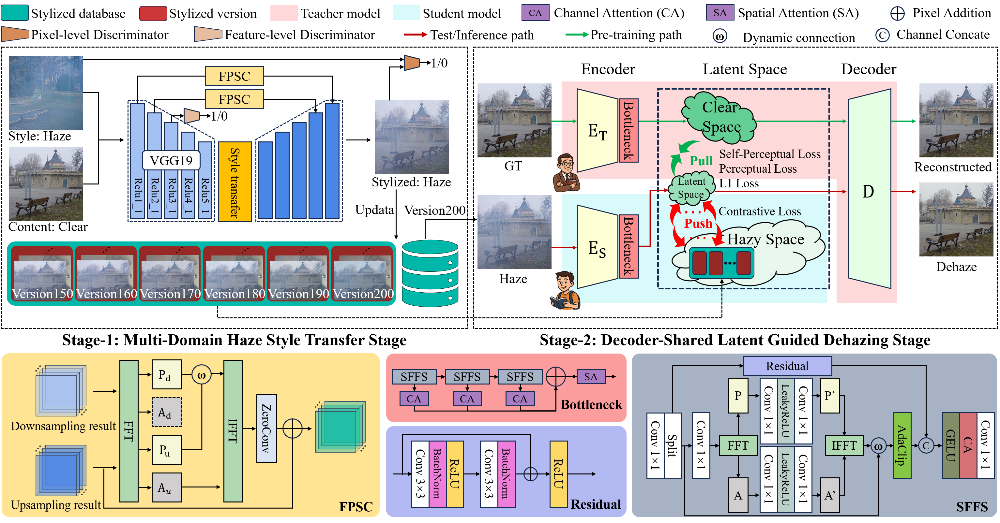
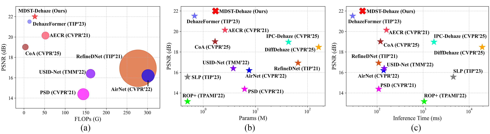

# MDST-Dehaze [PR 2026]

[]([www.example.com](https://www.sciencedirect.com/science/article/pii/S0031320326000579)) []([www.example.com](https://github.com/CunchuanHuang/MDST-Dehaze))

This is the official PyTorch codes for the paper:

> Haze Has Many Faces: Multi-Domain Haze Style Transfer for Diverse Haze Removal.
> Cunchuan Huang, Shuai Li, Xiang Chen, Jianlei Liu, Dengwang Li.
> Pattern Recognition (PR), 2026.



## 📣 News

- [2026.01.22] 🔥🔥🔥 We release the full source code for training and testing MDST-Dehaze.
- [2026.01.11] 🎉🎉🎉 Congratulations! Our paper accepted by *PR*.

## 💻 Environment

```
python=3.12
torch=2.5 (cuda12.4)
torchvision=0.20.0
numpy=1.26.0 (Error when >1.26.0)
pillow=11.0.0
opencv-python=4.11.0.86
visdom=0.2.4 (Optional)
```

## 🚀 Quick Inference

### C2H: Haze Generation

#### Step 1: Prepare dataset

Use the `example` dataset and download other dataset from [here](www.). The datasets need to be stored in the `./datasets`. If you are using your own dataset, you need to make sure that:

```
datasets
 |-- DATASET_NAME1  # your dataset name (source)
 |    |-- train
 |    |    |-- clear
 |-- DATASET_NAME2  # your dataset name (target)
 |    |-- train
 |    |    |-- haze
```

where `DATASET_NAME1` and `DATASET_NAME2` are the names of the source domain dataset and target domain dataset. If there is only one dataset, the source and target domains must be set the same in subsequent settings.

#### Step 2: Prepare configs

Edit `./configs/configs_inferenceC2H.py`, where `source` and `target` are set to the names of two identical or different datasets, representing the source domain and target domain respectively, and are used to generate paired haze images with the haze style of the target domain from clear images in the source domain.

```
source = DATASET_NAME1
target = DATASET_NAME2
```

#### Step 3: Prepare pretrained models

Download the pretrained model weights from [here](www.).

```
results
 |-- checkpoints
 |    |-- DATASET_NAME2
 |    |    |-- C2H.pth
```

#### Step 4: Run

```
cd scripts
python inference_C2H.py
```

If you want to obtain the generated haze results of the current source domain (`DATASET_NAME1`) mapped to another target domain (`DATASET_NAME3/4/...`), you need to reset the `target`, reload the corresponding model `C2H.pth`, and rerun `./scripts/inference_C2H.py`.

### H2C: Image Dehazing

#### Step 1: Prepare dataset

Use the `example` dataset or download other dataset from [here](www.). The datasets need to be stored in the `./datasets`. If you are using your own dataset, you need to make sure that:

```
datasets
 |-- DATASET_NAME   # your dataset name
 |    |-- test
 |    |    |-- haze
```

#### Step 2: Prepare configs

Edit `./configs/configs_inferenceH2C.py`, where `DATASET_NAME` is the name of your dataset, `haze_dir` is the folder storing the images to be dehazed, and `saved_model_Sen_path` and `saved_model_Tde_path` are the student encoder and shared decoder.

```
category = DATASET_NAME
haze_dir = '../datasets/DATASET_NAME/test/haze/'
saved_model_Sen_path = '../results/checkpoints/DATASET_NAME/Sen.pth'
saved_model_Tde_path = '../results/checkpoints/DATASET_NAME/Tde.pth'
```

#### Step 3: Prepare pretrained models

Download the pretrained model weights from [here](www.).

```
results
 |-- checkpoints
 |    |-- DATASET_NAME
 |    |    |-- Tde.pth
 |    |    |-- Sen.pth
```

#### Step 4: Run

```
cd scripts
python inference_H2C.py
```

## 🧱 Train

### Step 1: Prepare dataset

Use the `example` dataset or download other dataset from [here](www.). The datasets need to be stored in the `./datasets`. If you are using your own dataset, you need to make sure that:

```
datasets
 |-- DATASET_NAME   # your dataset name
 |    |-- test
 |    |    |-- clear
 |    |    |-- haze
 |    |-- train
 |    |    |-- clear
 |    |    |-- haze
```

### Step 2: Prepare configs

(1) Edit `./configs/configs_trainC2H.py`, where `DATASET_NAME` is the name of your dataset, `content_dir` and `style_dir` are the folders storing content (clear) images and style (haze) images, respectively.

```
category = DATASET_NAME
content_dir = '../datasets/DATASET_NAME/train/clear/'
style_dir = '../datasets/DATASET_NAME/train/haze/'
```

(2) Edit `./configs/configs_trainC2C.py`, and set the value of `DATASET_NAME`.

```
category = DATASET_NAME
```

(3) Edit `./configs/configs_trainH2C.py`, where `DATASET_NAME` is the name of your dataset, `clear_dir`, `haze_dir`, and `stylized_dir` are the folders storing clear images, stylized (haze) images, and the stylized database, `clear_val_dir` and `haze_val_dir` are the test sets, and `saved_model_Ten_path` and `saved_model_Tde_path` are the teacher encoder and shared decoder.

```
category = DATASET_NAME
clear_dir = '../datasets/DATASET_NAME/train/clear/'
haze_dir = '../results/stylized_database/DATASET_NAME/stylized200/'
stylized_dir = '../results/stylized_database/DATASET_NAME/'
clear_val_dir = '../datasets/DATASET_NAME/test/clear/'
haze_val_dir = '../datasets/DATASET_NAME/test/haze/'
saved_model_Ten_path = '../results/checkpoints/DATASET_NAME/Ten.pth'
saved_model_Tde_path = '../results/checkpoints/DATASET_NAME/Tde.pth'
```

### Step 3: Run

Running `./scripts/run.sh` to train stage-1 and stage-2.

```
cd scripts
chmod +x run.sh
./run.sh
```

If you want to train each model separately in the two stages, then:

#### Step 3.1: Training stage-1

Train stage-1 to obtain the haze generation model and the stylized database.

```
python train_C2H.py
```

#### Step 3.2: Training stage-2 (Teacher)

Train the teacher model in stage-2 to obtain the teacher encoder and shared decoder.

```
python train_C2C.py
```

#### Step 3.3: Training stage-2 (Student)

Train the student model in stage-2 to obtain the student encoder.

```
python train_H2C.py
```

## 🏆 Performance




## 📖 Citation

If you use this code or find our work helpful, please cite our paper:

```
@article{HUANG2026113094,
title = {Haze has many faces: Multi-domain haze style transfer for diverse haze removal},
journal = {Pattern Recognition},
volume = {175},
pages = {113094},
year = {2026},
issn = {0031-3203},
doi = {https://doi.org/10.1016/j.patcog.2026.113094},
url = {https://www.sciencedirect.com/science/article/pii/S0031320326000579},
author = {Cunchuan Huang and Shuai Li and Xiang Chen and Jianlei Liu and Dengwang Li},
}
```

## 📧 Contact

If you have any questions, please contact `cunchuan[at]qfnu[dot]edu[dot]cn`
